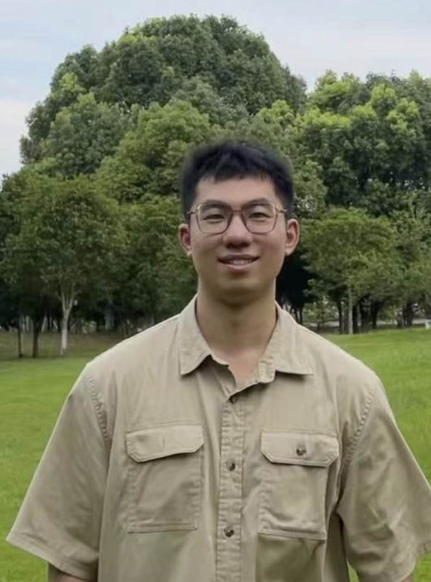

```bio-meta
{
    "name": "Minghao Lin",
    "title": "Minghao Lin",
    "description": "Minghao Lin",
    "url": "https://MinghaoLin2000.github.io/bio-site/",
    "assets": "https://MinghaoLin2000.github.io/bio-site/assets",
    "date-created": "2020-04-21",
    "repo": "https://github.com/MinghaoLin2000/MinghaoLin2000.github.io",
    "tilecolor": "#f2f2f2"
}
```

# Minghao Lin

<figure class="gl-page-background gl-float-right gl-image-box" style="text-align: center;"></figure>

I am an independent security researcher. I was a research assistant at Zhejiang University, advised by [Prof. Wenbo Shen](https://wenboshen.org/). Prior to this, I was a visiting scholar at the University of Colorado Boulder, advised by [Prof. Yueqi Chen](http://cusecurity.cs.colorado.edu/yueqichen/). I also worked closely with [Prof. Mingxue Zhang](https://zhangmx1997.github.io/) at Zhejiang University. I obtained my bachelor’s degree from Jiangxi Normal University at 2022.
During university, I founded the [Hyacinth Information Security Studio (JXNUSEC)](https://www.jxnusec.cn/index.html) to encourage more undergraduate and graduate students to engage in the field of cybersecurity.  

I can be reached at yenkoclike@gmail.com.

```bio-remove
Below we use a simple mechanism to mitigate email address reaping.
Change the encoding for your own email address.
```

<!--[bio][protect]
<script type="application/javascript">
window.setTimeout(function ()
{
var addr = [115,111,109,101,111,110,101,64,101,120,97,109,112,108,101,46,99,111,109];
addr = String.fromCharCode.apply(String, addr);
var eml = document.getElementById('_eml');
eml.innerHTML = '<a href="mailto:' + addr + '">' + addr + '</a>';
eml.removeAttribute('class');
}, 600);
</script>
[bio]-->

## Experiences
2023.09 - 2024.06 Research Assistant, Zhejiang University, advised by Prof. Wenbo Shen   
2023.01 - 2023.08 Visiting Scholar, The University of Colorado Boulder, advised by Prof. Yueqi Chen  
2022.01 - 2023.01 Senior Security Engineer, Embedded and Mobile Security Group, NIO Inc, Full time.   
2021.10 – 2022.01 Reverse Engineer, Game Security Center, Tencent Inc, Intern  
2021.02 – 2021.09 Mobile Security Researcher, Xuanwu Lab and Keen Lab, Tencent Inc, Intern


## Academic Publications
###### * indicates equal contribution
```blog-bib

@comment
{
Use #bibitem_Venue_Key to refer to "Venue:Key".

It is possible to have multiple BibTeX blocks, which will be rendered independently. For example, you might want to have one block for each of "Publications", "Pre-prints", and "Manuscripts".

To support more information links (e.g., add "slides" or "pdf" links),
see "builder/marked.0.3.6/bibtex-service.js" line 109.
}
* represents equal contribution/co-first author.
@online{GitHub:BibTeXTS,
  author = {Jiaxun Zhu* and \textbf{Minghao Lin*} and Tingting Yin and Zechao Cai and Yu Wang and Rui Chang and Wenbo Shen},
  title = {CrossFire: Fuzzing macOS Cross-XPU Memory on Apple Silicon},

  biosite_url = {},
  biosite_venue = {2024 ACM SIGSAC Conference on Computer and Communications Security (CCS)},
  
}

@online{GitHub:Marked,
  author = {\textbf{Minghao Lin} and Minghao Cheng and Dongsheng Luo and Yueqi Chen},
  title = {CLExtract: Recovering Highly Corrupted DVB/GSE Satellite Stream with Contrastive Learning},

  biosite_url = {https://www.ndss-symposium.org/ndss-paper/auto-draft-409/},
  biosite_venue = {2023 Workshop on the Security of Space and Satellite Systems (SpaceSec)},
  biosite_slides = {#},
}

```
## Industrial Publications
```blog-bib
@online{GitHub:BibTeXTS,
  author = {\textbf{Minghao Lin} and Zicheng Wang and Jiahe Wang and Chaoyang Lin and Minghang Shen and Yueqi Chen},
  title = {Kill Latest MPU-based Protections in Just One Shot: Targeting All Commodity RTOSes},

  biosite_url = {https://www.blackhat.com/us-23/briefings/schedule/#kill-latest-mpu-based-protections-in-just-one-shot-targeting-all-commodity-rtoses-32733},
  biosite_venue = {2023 BlackHat USA Briefing},
  biosite_demo = {https://github.com/MinghaoLin2000/TrampolineFuncAnalyzer4FreeRTOS},
  biosite_slides = {https://i.blackhat.com/BH-US-23/Presentations/US-23-Lin-Briefing-Kill-Latest-MPU-based-Protections.pdf},
  
  
}

@online{GitHub:Marked,
  author = {\textbf{Minghao Lin} and Minghao Cheng and Dongsheng Luo and Yueqi Chen},
  title = {An End-to-End Tool Decoding Highly Corrupted Satellite Stream from Eavesdropping},

  biosite_url = {https://www.blackhat.com/us-23/arsenal/schedule/#clextract-an-end-to-end-tool-decoding-highly-corrupted-satellite-stream-from-eavesdropping-31622},
  biosite_venue = {2023 BlackHat USA Arsenal},
  biosite_slides = {#},
}
@online{GitHub:Marked,
  author = {Minghang Shen and Chaoyang Lin and \textbf{Minghao Lin} and Qi Fan},
  title = {RTHunter:the High-Accuracy Reverse Symbol Recovery and Vulnerability Scanning Tool},

  biosite_url = {https://www.blackhat.com/asia-23/arsenal/schedule/#rthunterthe-high-accuracy-reverse-symbol-recovery-and-vulnerability-scanning-tool-30612},
  biosite_venue = {2023 BlackHat Asia Arsenal},
  biosite_slides = {#},
}

```

## Bugs
### Well-known Operate Systems (macOS/iOS/Windows/Android)
- CVE-2024-40788, CVE-2024-27826, [Multiple Apple Neutral Engine Compiler Errors]([https://support.apple.com/en-us/121238), CVE-2024-43533, CVE-2024-20136, CVE-2024-20116, CVE-2024-20107, CVE-2024-20097, CVE-2024-20096, CVE-2024-20095, CVE-2024-20093, CVE-2024-20092, CVE-2024-20091, CVE-2024-20090, CVE-2024-20088, CVE-2024-20083, CVE-2024-20013, CVE-2023-32876, CVE-2023-32875, CVE-2023-32873, CVE-2023-32872, CVE-2023-32821, CVE-2023-32819, CVE-2023-32818, CVE-2023-20833, CVE-2023-20823, CVE-2023-20780, CVE-2023-20759, CVE-2023-20758, CVE-2023-20757, CVE-2023-20755, CVE-2023-20711, CVE-2023-20708, CVE-2023-20635, CVE-2023-20634  

### IOT Devices (FreeRTOS, TP-Link, D- Link, Tenda, Fast, MERCURY, DrayTek,SonicWall, Cisco, AMD)
- CVE-2024-28115, CVE-2022-30472, CVE-2022-30473, CVE-2022-30474, CVE-2022-30475, CVE-2022-30476, CVE-2022-30477, CVE-2022-20842, CVE-2021-31755, CVE-2021-31757, CVE-2020-19667, CVE-2020-19668, CVE-2020-28877, CVE-2020-28373, CVE-2020-19662, CVE-2020-19664, CVE-2020-19663, CVE-2020-14993, CVE-2020-15415

### Open source Projects
- [PDF-Writer \#278](https://github.com/galkahana/PDF-Writer/issues/278), [PDF-Writer \#279](https://github.com/galkahana/PDF-Writer/issues/279), [mac \#19](https://github.com/felixangell/mac/issues/19), [mac \#20](https://github.com/felixangell/mac/issues/20), [mac \#21](https://github.com/felixangell/mac/issues/21)  

##### Credits: [Jiaxun Zhu](https://pricx.github.io/), [Xilong Zhang@Resery](https://github.com/Resery), [Mas0n](https://x.com/mas0nshi), [peanuts](https://github.com/peanuts62), [Cylin](https://github.com/lcyfrank), who collaborated with me to find these bugs. 

## Main Awards as A Core Member
• 2024 Geekcon AVSS Contest International Final, 1st, $3000  
• 2023 DataCon Big Data Vulnerability Analysis Track, 2st, $4000   
• 2022 DataCon Big Data IOT Security Track Online, 1st, $2500    
• 2022 Tencent Game Security CTF Final, 6th  
• 2021 National Industrial Internet CTF Student Group, 1st, $4000  
• 2021 Jiangxi Industrial Internet Provincial CTF, 1st, $3000  
• 2021 Jiangxi College Student Network Security Competition, 1st, $700  
• 2021 National offensive and defensive drills (with Tencent attack team), 1st  